<div align="center">


### por **Fabiano Silva dos Anjos**

<a href="https://github.com/fabiano0147">
  
</a>

<br/>


</div>

<br/>

## 🧠 Sobre mim

```text
> fabiano_labs.status()

  ▸ Quem ............... Fabiano Silva dos Anjos — desenvolvedor, criador do FABIANO//LABS
  ▸ O que faço ......... software, automação e soluções digitais com IA
  ▸ Stack principal .... Python • PyQt6 • FastAPI • Next.js / TypeScript
  ▸ IA ................. Google Gemini • Claude (Anthropic) • Groq • OpenCV / MediaPipe
  ▸ Interesses ......... agentes autônomos, automação de computador, interfaces cinematográficas
  ▸ Status ............. online ● sempre construindo algo novo
```

- 🧪 **FABIANO//LABS** é o meu laboratório: onde ideias viram software, automações e produtos digitais com IA.
- 🤖 Programo **com IA e para IA**: integro LLMs multimodais (voz, visão, tools) e agentes que executam tarefas de ponta a ponta.
- ⚙️ Construo **automações** que tiram o trabalho repetitivo do caminho, do desktop à web.
- 🖥️ Prefiro software **local-first**, **multiplataforma** e com interface pensada como produto.

<br/>

## ⚙️ Stack

<div align="center">

**Linguagens & Frameworks**


<br/><br/>

**IA & Visão**


<br/><br/>

**Infra & Ferramentas**


</div>

<br/>

## 📊 Dashboard

<div align="center">

<!-- Cards gerados pelo workflow .github/workflows/stats.yml (sem depender de servidor externo) -->



<br/><br/>


<br/><br/>


</div>

<br/>

## 🐍 Contribuições

<div align="center">
<picture>
  <source media="(prefers-color-scheme: dark)" srcset="https://raw.githubusercontent.com/fabiano0147/fabiano0147/output/github-contribution-grid-snake-dark.svg">
  <source media="(prefers-color-scheme: light)" srcset="https://raw.githubusercontent.com/fabiano0147/fabiano0147/output/github-contribution-grid-snake.svg">
  
</picture>
</div>

<br/>

## 🚀 Projetos

| Projeto | Tipo | O que é | Stack |
|---|---|---|---|
| **JARVIS OS** 🔒 | Projeto pessoal | Assistente de voz com IA para desktop: modo Live com Gemini (áudio nativo), HUD em PyQt6, agente Claude em segundo plano, estúdio de apresentações e 1.800+ testes automatizados. | Python · PyQt6 · FastAPI · Next.js · Gemini · Claude |
| **Orçamento** 🔒 | Aplicação | Sistema de orçamentos com backend e frontend separados. | JavaScript · HTML · CSS |
| [**Café Branyl**](https://github.com/fabiano0147/cafe-branyl) | PWA | Cardápio instalável para café da manhã, com service worker e manifest. | HTML · JavaScript · PWA |

> 🔒 repositório privado. Esta lista cresce com o tempo: novos projetos do **FABIANO//LABS** entram aqui conforme forem publicados.

<br/>

## 🌐 Contato

<div align="center">

<a href="mailto:fabianotech.anjos@gmail.com"></a>
<a href="https://github.com/fabiano0147"></a>
<!-- Para adicionar o LinkedIn, troque SEU-USUARIO e remova os marcadores de comentário: -->
<!-- <a href="https://www.linkedin.com/in/SEU-USUARIO"></a> -->

</div>

<br/>

<div align="center">

</div>
